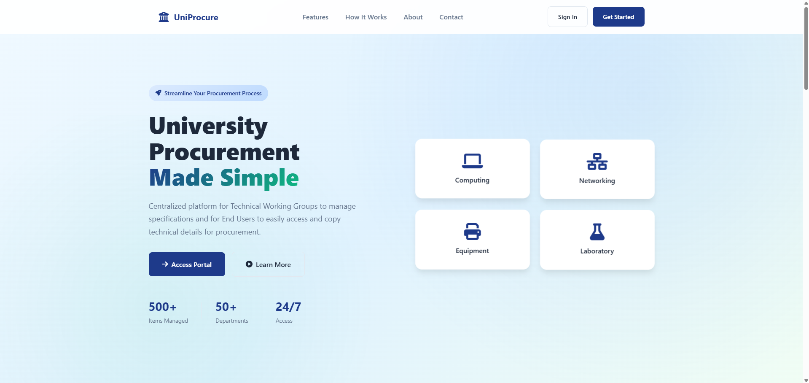
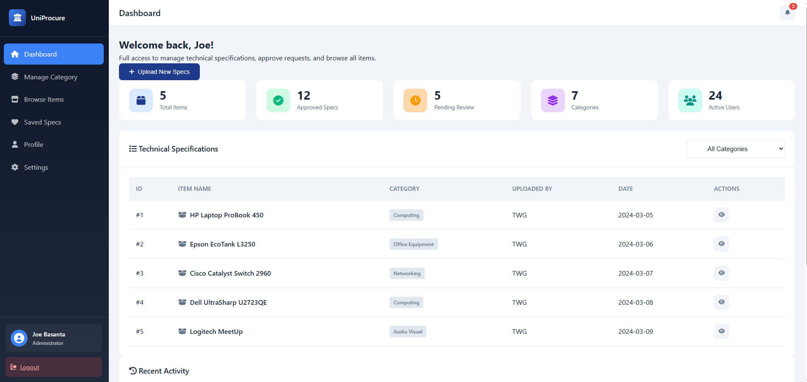
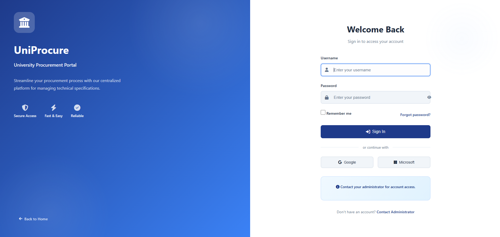

# UniProcure System (Showcase)

> A web-based procurement management system designed to streamline university procurement processes.

---

## 📝 Description
UniProcure is a private internal system developed for managing procurement requests, approvals, and reporting.  
This showcase repository highlights the features and workflow without revealing sensitive code or credentials.

---

## ⚙️ Features

- Submit procurement requests online  
- Multi-level approval workflow  
- Dashboard with real-time statistics  
- Reporting and export functionality  
- Role-based access (admin, requester, approver)  
- Secure handling of data (credentials not included)

---

## 🛠 Tech Stack

- **Backend:** PHP  
- **Database:** MySQL  
- **Frontend:** HTML, CSS, JavaScript, jQuery, Bootstrap 5  
- **Version Control:** GitHub (private core repo)

---

## 📸 Screenshots

  
*Example procurement request form*

  
*Admin dashboard showing request status and stats*

  
*Admin dashboard showing request status and stats*

---

## 📂 Structure (Showcase Only)

- `README.md` — This file  
- `screenshots/` — Images of the system interface  

> **Note:** The actual system code is private and not included here for security reasons.

---

## ⚡ Usage

This repo is for **demonstration and portfolio purposes only**.  
For inquiries or collaboration, contact the developer:

- **Email:** blocker25@gmail.com  
- **GitHub:** [https://github.com/block3r25](https://github.com/block3r25)

---

## 🚀 Roadmap (Optional)

- Add analytics and reporting module  
- Mobile-friendly interface  
- Integration with university authentication system  

---

## 🔒 Security Note

This public repo contains **no sensitive information**.  
All database credentials, API keys, and internal configurations are stored securely in the private repository.

---
